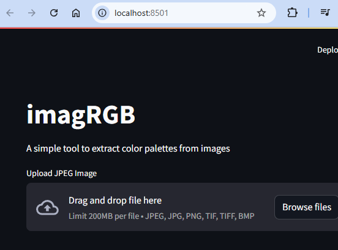
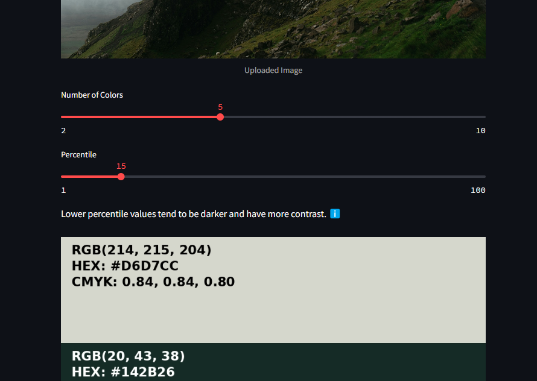
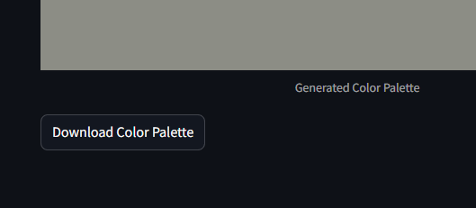

# imagRGB

Project for converting images to color palettes. Fall-2024-HCI-584

## User Guide

imagRGB can be used with one of two different interfaces:
  1. A graphical Streamlit app (GUI) run on your computer. This interface is the easier to use if you just want upload images and see generated color palettes.
  2. A Command Line Interface (CLI). This interface is good if plan to call imagRGB from another program, don't have a graphical option on the target computer, or just prefer using the CLI.

Below you will find details for running each interface. To run either you need to **install the necessary dependencies**.

This guide assumes you are comfortable using a terminal command line interface to clone the project, install dependencies, and run the application. The exact terminal interface you use will depend on your operating system and personal preference.  

### Step 1 (GUI and CLI): Clone this Project

You can of course use a graphical git client like Github Desktop, and I will leave those specific cloning steps to you.

If instead you want to use a terminal CLI. Run the following:
`git clone https://github.com/maraljr/imagRGB.git`

### Step 2 (GUI and CLI): Install Python.

This project is designed to work with python verion 3.12.6 specifically, but most versions 3.12.x or higher should work. The easiest way to install python is to use the installer for your operating system available on [python.org](https://www.python.org/downloads/)

### Step 3 (GUI and CLI): Install Dependencies.

To run this project you will need the following packages installed:
- Pillow
- numpy
- scikit-learn
- opencv-python
- streamlit (this can be excluded if you will only use the CLI)

A [requirements.txt](./requirements.txt) file is included in the project, so you can install these libraries by running `pip install -r requirements.txt` from the root of the project.

The easiest way to verify that you have the necessary requirements installed is to try to run the application.

### Step 4 (GUI only): Run the Streamlit App

Start a locally hosted streamlit app by running `streamlit run app.py`. If working correctly, this command will output a localhost URL, likely `Local URL: http://localhost:8501`.

Navigate to the URL output in your web browser, and you will see the running streamlit app.



### Step 5 (GUI only): Upload an Image and Generate a Color Pallete

This project includes example images in the `/example-images` folder. The entire app is meant to be self-explanatory. The upload feature of the app supports browsing for a file on you machine or dragging and dropping into the web page. Just upload a image and play around with the app! The color palettes will automatically be created and updated whenever you make changes.

Try to adjust the sliders for "Number of Colors" and "Percentile" to see what different results you get.


Don't overlook the download button at the bottom of page that will allow you to download you color palette.


### Step 4 (CLI only): Invoke the Script with Arguments

Run the application by running [main.py](./main.py): `python main.py [IMAGE_PATH]`. You must provide the image path as a positional argument. You can provide other optional arguments to adjust the output. Run `python main.py --help` for a list of arguments.
```
usage: main.py [-h] [--num_colors NUM_COLORS] [--output_dir OUTPUT_DIR] [--output_name OUTPUT_NAME] [--percentile PERCENTILE] image_path

Generate a color palette from an image.

positional arguments:
  image_path            Path to the input image file.

options:
  -h, --help            show this help message and exit
  --num_colors NUM_COLORS
                        Number of colors to extract from the image. 1-10. Default is 5.
  --output_dir OUTPUT_DIR
                        Directory to save the color palette image. Default is ./palettes/
  --output_name OUTPUT_NAME
                        Name of the output color palette image. Default is the input file name plus added data.
  --percentile PERCENTILE
                        Percentile for color extraction. 1-100. Default is 15. Lower percentile values tend to be darker and have more contrast.
```

## More Documentation for Developers

For a detailed developer guide, including an overview of the program, explanations of key files, and useful links, please refer to the [Developer Guide](./docs/DEVELOPER.md).

## Attribution
- [Example images](./example-images/) in this project were sourced from [https://unsplash.com/](https://unsplash.com/)