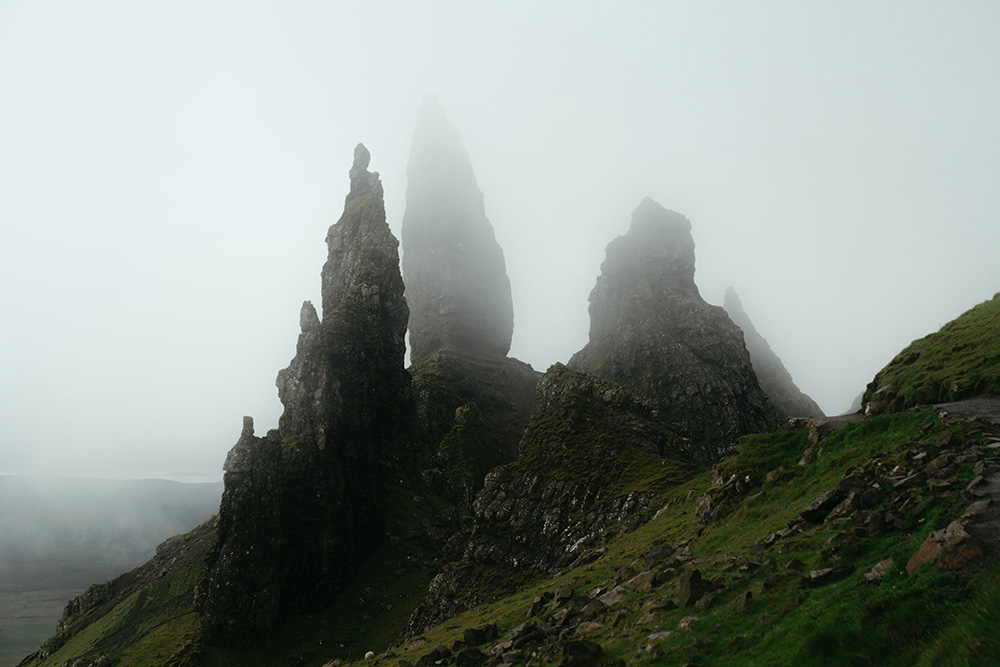
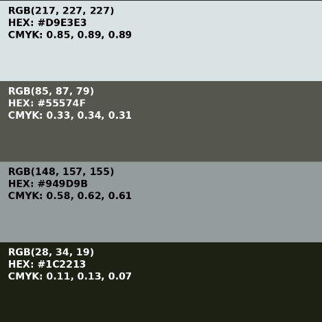

### imagRGB: Version 1 Review

#### General Description of the Project

**imagRBG** is a Python-based application that generates customizable color palettes from user-provided images. The application is aimed at designers, artists, and developers, and extracts dominant colors from images to inspire and inform creative projects. The core feature involves analyzing an image to identify the most prevalent colors and presenting them with detailed information, enhancing the user's ability to incorporate these colors into their work.

#### Key Features (Implemented)

- **Dominant Color Extraction:** Identifies the most significant colors in an image.
- **Customizable Output:** Users can specify the number of colors in the palette.
- **Detailed Color Information:** Displays HEX codes, RGB values, and CMYK values.
- **Palette Saving and Exporting:** Currently, the app outputs an image file with the palette colors labeled with color codes.

#### Demonstration of the Application

- A user can run the app by calling the `main.py` file from a terminal: `python main.py`.
- A user can change the input file or the number of colors for the palette by modifying the hard-coded values in the `main()` function block.
- The app prints out text instructions to guide the user, and a palette image is output to a directory.

**Input Image**

**Output Palette**

#### Issues During Development

- The extraction of dominant colors did not always yield satisfactory results, subjectively. The output colors seemed to be somewhat muted compared to the input image. There appears to be an "averaging" effect when extracting dominant colors, and I would prefer the app to extract colors that better represent the "highlights" of the input image.
- Implementing friendly color name labeling for the output color palette proved to be more challenging than expected. The Webcolors library only supports direct conversion of exact colors to their corresponding friendly names. Any color that does not have an exact match results in an exception. I could not find another library that supports finding the "nearest" friendly name, and implementing this analysis within the app seems quite complex. Therefore, this feature has been removed from the current scope.

#### Milestones for the Coming Weeks

1. **Milestone 1: Core Functionality Refinement**

   - Ensure that the **dominant color extraction** feature is refined to produce high-quality results, including setting boundaries on the number of colors that can be extracted.
   - Implement **customizable output** with defined boundaries on the number of colors that can be extracted to ensure optimal performance and usability.

2. **Milestone 2: CLI Interface Implementation**

   - Develop the **CLI interface** to provide users with efficient and straightforward access to the core functionality of the application.

3. **Milestone 3: Create GUI and CLI Improvements**

   - Create the **Streamlit GUI** to enhance user experience.
   - Improve **CLI features** for user input flexibility and usability.

4. **Milestone 4: Save and Export Feature**

   - Develop **save and export** functionality to allow users to download generated palettes as image files or JSON data.

5. **Milestone 5: Support Adjustments to Colors in Palette**

   - Depending on the use case, a color in the palette may be used as a range of up to 9 variations.
   - Implement **brightness adjustments** to allow users to fine-tune the brightness of extracted colors.
   - Add **saturation adjustments** for further customization of the palette colors.
   - Ensure adjustments are available in both **GUI and CLI interfaces**.

6. **Milestone 6: Host the Streamlit App on a Cloud Service**

   - Deploy the **Streamlit application** to a cloud platform to make it accessible to users online.

#### Self-Reflection

The progress so far has been satisfactory, although some features turned out more challenging than expected, particularly the **friendly color naming** feature, which has since been removed. I had hoped to find a library that could accurately label colors with friendly names, but none provided the exact functionality needed.

Given the work done and the remaining milestones, I believe the project can be completed within the allocated time, focusing on the core features. I feel comfortable implementing the basic CLI capabilities. The Streamlit app GUI is still unfamiliar to me, but I am hopeful that I can create a visually appealing interface for the application.

